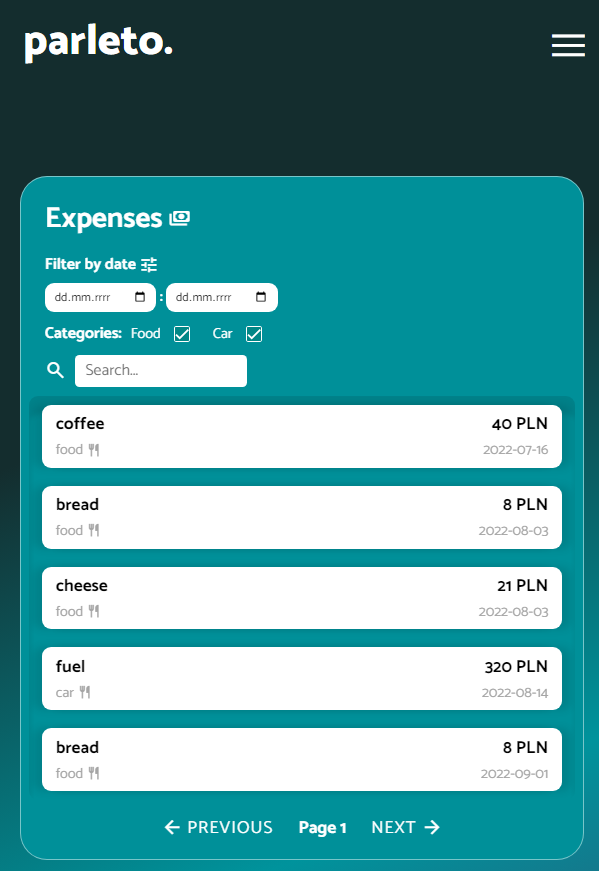

# Expenses App UI

## Project Description

The goal of this project was to create a web page that displays expenses data in a visually appealing way. The provided raw data of expenses needed to be transformed into a user-friendly interface that allows sorting based on various criteria. The project also required demonstrating responsive design principles to ensure the page works well on different devices.

## Features

- Displaying expenses data using HTML and CSS.
- Utilizing JavaScript to dynamically sort and display expenses.
- Implementing responsive design to ensure a seamless experience on various screen sizes.

## Technologies Used

- HTML
- SCSS with media queries
- JavaScript

## Usage

1. Clone the repository: `git clone https://github.com/m1ckeyyy/expenses-app-ui.git`
2. Open the `index.html` file in a web browser.

OR just download index.html alone and run it in a web browser.

## Screenshots

 

## Conclusion

Completing this recruitment task allowed me to showcase my creative skills in designing and developing a responsive web page. By transforming raw data into a user-friendly interface and implementing sorting functionality, I gained valuable experience in front-end development.
